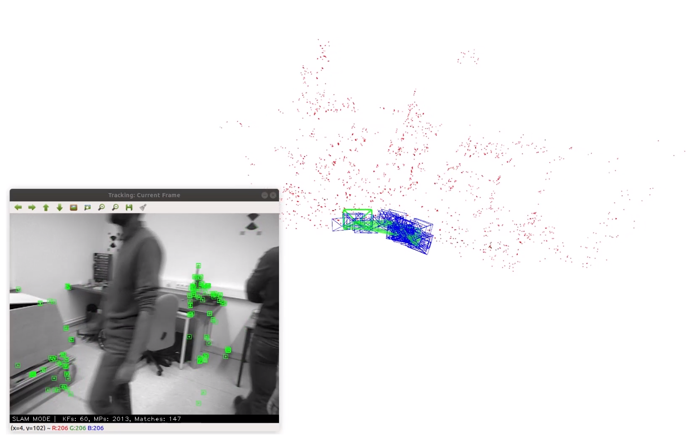
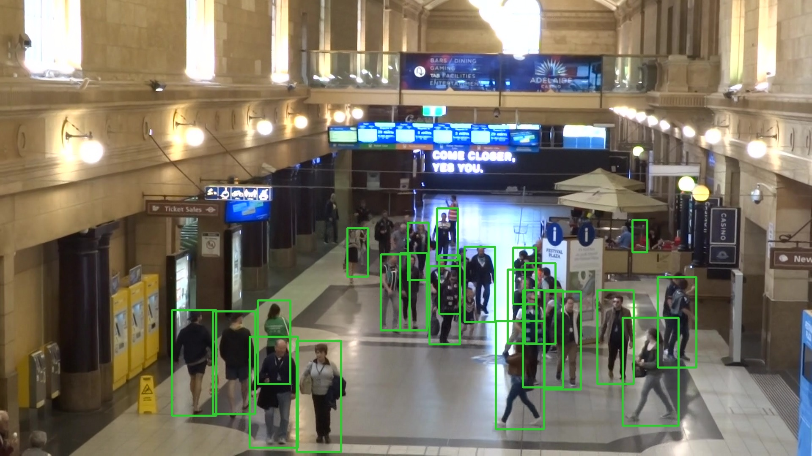

# Crowd-SLAM

Crowd-SLAM is a visual SLAM system that is robust in crowded scenarios.

</a>
</a>

# License

Crowd-SLAM is released under a GPLv3 License.

If you use Crowd-SLAM in an academic work, please cite:

    @article{soaresJINT2020,
      title={Crowd-{SLAM}: Visual {SLAM} Towards Crowded Environments using Object Detection},
      author={Soares, J. C. V., Gattass, M. and Meggiolaro, M. A.},
      journal={Journal of Intelligent & Robotic Systems},
      volume={},
      number={},
      pages={},
      doi = {},
      year={2020}
     }
     
# Prerequisites
We have tested the library in **Ubuntu 18.04**.

# Acknowledgements
Our code builds on [ORB-SLAM2](https://github.com/raulmur/ORB_SLAM2).
